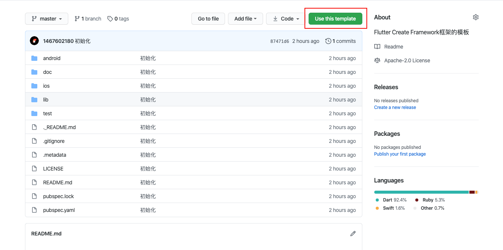

# 快速上手

## 环境准备

- 确保你的开发设备安装好了FLutter的开发环境，若没有，你应该查看[Flutter安装](https://flutter.cn/docs/get-started/install)
- Git环境，若没有，你应该查看[Git教程](https://www.runoob.com/git/git-tutorial.html)


你可以选择用简单的Template直接上手开发或者查看完整Template进行学习。

## 拉取简单Template

访问[github模板仓库](https://github.com/1467602180/flutter-create-framework-template)或[gitee模板仓库](https://gitee.com/hfybbs/flutter-create-framework-template)

点击使用该模板，创建你的代码仓库，然后clone下来进行开发



## 拉取完整Template

打开终端，执行代码，将框架代码拉取至你的电脑上

```shell
# Github(国外仓库)
git clone https://github.com/1467602180/flutter-create-framework.git
# Gitee(国内仓库)
git clone https://gitee.com/hfybbs/flutter-create-framework.git
```


## 下载pub包

拉取完框架代码后，进入项目目录，执行命令

```shell
flutter pub get
```


## 运行

下载完pub包后，直接运行即可查看示例

```shell
flutter run
```

