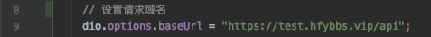
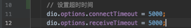
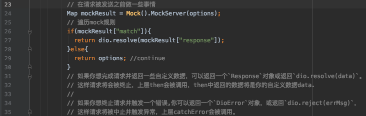

# 功能模块

## 网络请求

### 请求域名

位于：`/lib/util/request_util.dart`




### 请求超时

位于：`/lib/util/request_util.dart`



### 发送请求

参考示例文件`/lib/api/user_info_api.dart`，新建个类似的示例：

```dart
import 'package:dio/dio.dart';
import 'package:flutter_create_framework/util/request_util.dart';

Future<Response> UserInfo()async{
  return await Request().get("/userinfo");
}
```

然后在业务代码中调用该方法即可，参考示例文件：`/lib/layout/mockRequest/mock_request.dart`

```dart
UserInfo().then((value){
    setState(() {
        data = value.data["data"];
    });
});
```

## 国际化

### 安装插件

插件可以帮助我们快速的生成国际化代码，以Android Studio为例：

`File --> Settings… --> Plugins --> 搜索“flutter Intl”，安装该插件，重启AndroidStudio`

### 配置与初始化

#### 配置

pubspec.yaml文件新增本地化依赖：

```yaml
dependencies:
    // Other dependencies...
    flutter_localizations:
        sdk: flutter
```

然后flutter pub get获取该依赖

#### 工程初始化

在菜单栏的Tool下找到Flutter Intl 并选择Initalize for the project，配置结束之后，会自动在 pubspec.yaml中增加以下字段：

```yaml
flutter_intl:  
    enabled: true
```

会在lib目录下增加 generated 和 l10n两个包，框架下的目录就是如此生成的

#### 代码初始化

框架已经做了这一步，想深入的可以了解一下

```dart
import 'package:flutter/material.dart';
import 'package:flutter_localizations/flutter_localizations.dart';
import 'generated/l10n.dart';
class MyApp extends StatelessWidget {
  @override
  Widget build(BuildContext context) {
    return MaterialApp(
      localizationsDelegates: const [
        S.delegate,
        GlobalMaterialLocalizations.delegate,
        GlobalCupertinoLocalizations.delegate,
        GlobalWidgetsLocalizations.delegate
      ],
      //supportedLocales: S.delegate.supportedLocales,
      // 设置中文为首选项
      supportedLocales: S.delegate.supportedLocales,
      // 获取翻译文案的内容需要在能获取到上下文的前提下才能生效，也就是说只能对MaterialApp
      // 的子组件才会生效，所以下面的方法设置动态Title是不行的，需要使用回调方法onGenerateTitle
      //title: S.of(context).app_name,
      onGenerateTitle: (context) => S.of(context).app_name,
      //home: MyHomePage(title: S.of(context).main_message),
      home: MyHomePage(title: 'Flutter Demo Home Page'),
    );
  }
}
```

### 抽取字符串

#### 新建需要支持的语言文件

在lib/I10n文件夹右键 --> New --> Arb File，输入对应的locale code，如“zh”。
或者在Tools --> Flutter Intl --> Add Locale，效果是一样的。

#### 抽取字符串

选中字符串或者在字符串后面按快捷键“Alt + Enter” --> Extract to ARB file
勾选该字符串要抽取到哪些Arb文件，其实就是在各个arb文件下添加相应的字符串字段，需要到对应的arb文件修改成相应语言的字符串。

### 使用

在需要配置国际化的地方调用`S.of(context).字符串字段`即可

一些方法：

```dart
# 强制使用某种语言
S.load(Locale('de', 'DE'));
# 获取当前语言
Intl.getCurrentLocale()
```

## Mock服务

该模块的核心在于 [dio](https://pub.flutter-io.cn/packages/dio)提供的返回自定义数据功能，代码位于：`/lib/util/request_util.dart`



### 增加mock规则

该模块通过 [faker](https://pub.flutter-io.cn/packages/faker)包，可以定义十分真实的返回数据

示例代码位于：`/lib/mock/role/user_info_role.dart`

```dart
import 'package:faker/faker.dart';

List UserInfoRole(){
  return [
    {
      "path":'/userinfo',
      "method":"GET",
      "response":{
        "status":0,
        "data":{
          "username":faker.internet.userName(),
          "email":faker.internet.email(),
          "address":faker.address.city()
        }
      }
    }
  ];
}
```

其中`path`和`method`就是匹配的规则，每一次的request的请求都会遍历一次规则，符合规则即返回自定义的返回数据

## 路由

框架的路由是基于官方的路由进行了简单封装，核心代码位于：`/lib/router/router.dart`

### 新增路由

参考示例文件：`/lib/router/routes.dart`

```dart
List<Map<String,dynamic>> Routes(){
  return [
    {
      "path":"/",
      "view":Home(),
    },
    {
      "path":"/changeLanguage",
      "view":ChangeLanguage(),
    },
    {
      "path":"/stateManage",
      "view":StateManage()
    },
    {
      "path":"/editStateManage",
      "view":EditStateManage()
    },
    {
      "path":"/mockRequest",
      "view":MockRequest()
    },
    {
      "path":"/mockRequest",
      "view":MockRequest()
    },
    {
      "path":"/utilsManage",
      "view":UtilsManage()
    }
  ];
}
```

按格式增加路由即可，后续会考虑增加`路由动画`等功能

### 嵌套路由

```dart
//嵌套路由示例
{
    // 上层路由无需view
    "path":"/busManage",
    "children":[
        // 匹配规则为"/busManage/demo1"
        {
            "path":"/demo1",
            "view":Demo1()
        ,{
        // 匹配规则为"/busManage/demo2/demo3"
            "path":"/demo2",
            "children":[
                {
                    "path":"/demo3",
                    "view":Demo3()
                }
            ]
        },
    ]
}
```

### 路由跳转

按照官方的路由方式操作即可

```dart
// 跳转
Navigator.of(context).pushNamed("/");
// 后退
Navigator.of(context).pop();
// 替换当前路由
Navigator.of(context).pushReplacementNamed("/");
// 跳转路由并删除所有路由
Navigator.of(context).pushNamedAndRemoveUntil("/", (route) => false);
```

### 自定义路由

封装实现的动画路由，可自定义动画，传参，核心封装代码位于`util/router_util.dart`

#### 使用方法

```dart
//mode为动画方式，slide：平滑，fade:渐变，scale：缩放，rotation：旋转，rotationScale：旋转缩放，默认为平滑动画
//argument为传参，下个页面直接使用argument即可
// 跳转
RouterUtil.pushNamed(context,"/",mode:'slide',argument:'params');
// 替换当前路由
RouterUtil.pushReplacementNamed(context,"/",mode:'slide',argument:'params');
// 跳转路由并删除所有路由
RouterUtil.pushNamedAndRemoveUntil(context,"/",mode:'slide',argument:'params');
```

#### 自定义动画

核心代码在`util/router_util.dart`的`66`行

```dart
switch (mode) {
                case 'slide':
                  routerWidget = SlideTransition(
                    child: child,
                    position: Tween<Offset>(
                            begin: Offset(1.0, 0.0), end: Offset(0.0, 0.0))
                        .animate(CurvedAnimation(
                            parent: animation1, curve: Curves.ease)),
                  );
                  break;
                case 'fade':
                  routerWidget = FadeTransition(
                    child: child,
                    opacity: Tween(begin: 0.0, end: 1.0).animate(
                        CurvedAnimation(
                            parent: animation1, curve: Curves.linear)),
                  );
                  break;
                case 'scale':
                  routerWidget = ScaleTransition(
                    child: child,
                    scale: Tween(begin: 0.0, end: 1.0).animate(CurvedAnimation(
                        parent: animation1, curve: Curves.linear)),
                  );
                  break;
                case 'rotation':
                  routerWidget = RotationTransition(
                    child: child,
                    turns: Tween(begin: 0.0, end: 1.0).animate(CurvedAnimation(
                        parent: animation1, curve: Curves.linear)),
                  );
                  break;
                case 'rotationScale':
                  routerWidget = RotationTransition(
                    child: ScaleTransition(
                      child: child,
                      scale: Tween(begin: 0.0, end: 1.0).animate(
                          CurvedAnimation(
                              parent: animation1, curve: Curves.linear)),
                    ),
                    turns: Tween(begin: 0.0, end: 1.0).animate(CurvedAnimation(
                        parent: animation1, curve: Curves.linear)),
                  );
                  break;
              }
//需要自定义动画直接在后面添加即可，判断的是mode的值
```


## 调试打印

基于 [logger](https://pub.flutter-io.cn/packages/logger)库封装了一个调试打印的工具类，可打印`Object`

### 开启调试

位于`/lib/config/server_config.dart`

```dart
class ServerConfig{
  //  是否为调试模式，是则打印日志
  bool Debug(){
    return true;
  }
}
```

仅作用于使用该工具类的调试输出

### 使用

```dart
// 调试输出
LoggerUtil.d(optionsMap);
```

一般使用调试输出即可

核心代码位于`/lib/util/logger_util.dart`

```dart
class LoggerUtil{
  LoggerUtil.v(dynamic v){
    if(ServerConfig().Debug()){
      Logger().v(v);
    }
  }
  // 调试
  LoggerUtil.d(dynamic d){
    if(ServerConfig().Debug()){
      Logger().d(d);
    }
  }
  // 信息
  LoggerUtil.i(dynamic i){
    if(ServerConfig().Debug()){
      Logger().i(i);
    }
  }
  // 错误
  LoggerUtil.e(dynamic e){
    if(ServerConfig().Debug()){
      Logger().e(e);
    }
  }
  // 警告
  LoggerUtil.w(dynamic w){
    if(ServerConfig().Debug()){
      Logger().w(w);
    }
  }
  // WTF
  LoggerUtil.wtf(dynamic wtf){
    if(ServerConfig().Debug()){
      Logger().wtf(wtf);
    }
  }
}
```

## 状态管理

基于 [provider](https://pub.flutter-io.cn/packages/provider)库，示例代码位于：`/lib/provider/user_provider.dart`

```dart
class UserProvider with ChangeNotifier{

//  用户名
  String _username = 'Test User';
  get username => _username;

  void setUserName(String username){
    _username = username;
    notifyListeners();
  }

//  手机号
  String _phone = '13243737777';
  get phone => _phone;

  void setPhone(String phone){
    _phone = phone;
  }

//  地址
  String _address = 'GuangZhou';
  get address => _address;

  void setAddress(String address){
    _address = address;
  }

}
```

然后在`/lib/main.dart`中引用

```dart
void main()async{
  WidgetsFlutterBinding.ensureInitialized();
  await SpUtil.getInstance();
  runApp(
    MultiProvider(providers: [
      ChangeNotifierProvider(create: (_)=>UserProvider())
    ],child: MyApp(),)
  );
}
```

之后便可以在项目中直接使用

```dart
// 示例方法

//绑定UserProvider中的username
context.watch<UserProvider>().username
//调用UserProvider中的setUserName方法
context.read<UserProvider>().setUserName(username);
//或者
Provider.of<UserProvider>(context,listen:false).username;
Provider.of<UserProvider>(context,listen:false).setUserName(username);
//最终结果是一致的，差异就是第二种方法不用区分watch和read
//更多用法你应该去看官方的api文档
```


## 主题配置

位于`/lib/config/theme_config.dart`

```dart
//主题配置
ThemeData ThemeConfig(){
  return ThemeData(
    primarySwatch: Colors.blue,
    visualDensity: VisualDensity.adaptivePlatformDensity,
    primaryColor: Colors.white, //主色调
    appBarTheme: AppBarTheme(
      elevation: 0 //导航栏阴影
    ),
    scaffoldBackgroundColor: Colors.white, //背景颜色
    highlightColor: Colors.white, //高亮颜色
    splashColor: Colors.white, //波纹颜色
    inputDecorationTheme: InputDecorationTheme(
      labelStyle: TextStyle(color: Colors.black)
    )
  );
}
```

## 工具集

参考库 [flustars](https://pub.flutter-io.cn/packages/flustars)

## 发布订阅事件流

基于[fbroadcast](https://github.com/Fliggy-Mobile/fbroadcast/blob/master/README_CN.md)库进行了简单的封装而成

封装代码位于：`util/bus_util.dart`

```dart
class BusUtil{
//  发送事件封装
  BusUtil.emit(String name,dynamic data){
    FBroadcast.instance().broadcast(name,value: data);
  }

//  注册事件封装
  BusUtil.on(String name,Function result){
    FBroadcast.instance().register(name, (value, callback) {
      result(value,callback);
    });
  }
}
```

使用示例位于：`layout/busManage/bus_manage.dart`

```dart
// 发送事件
BusUtil.emit('send_event', textEditingController.text);

// 接收事件
BusUtil.on('send_event', (data, callback) {
	// Toast显示数据
	BotToast.showText(text: data);
});
```

**更多丰富用法查看库[flustars](https://pub.flutter-io.cn/packages/flustars)**

